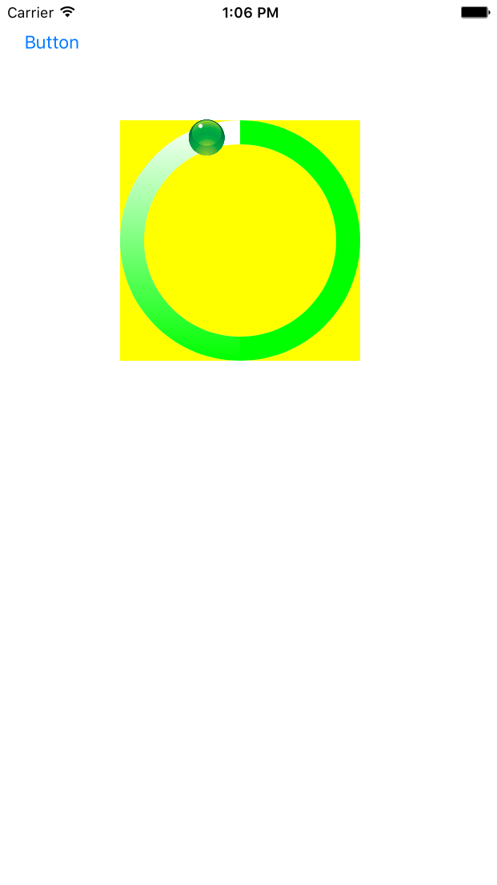

# ZZGradientCircleProgressViewWithDot

Gradient circle progress view

###使用方法：

```
- (void)viewDidLoad {
    [super viewDidLoad];
    self.progressView             = [[ZZGradientCircleProgressView alloc] initWithFrame:CGRectMake(100, 100, 200, 200)];
    _progressView.backgroundColor = [UIColor yellowColor];
    _progressView.trackColor      = [UIColor whiteColor];
    _progressView.progress        = 0.0f;
    _progressView.progressWidth   = 20;
    _progressView.gradientColor   = [UIColor greenColor];
    _progressView.showProgressIndicator = YES;
    [self.view addSubview:_progressView];
}

```

###效果图


